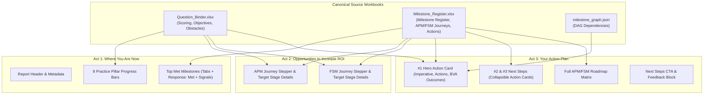

# Maximo Growth Readiness Assessment — Report Layout & Data Binding Specification
*Authoritative Design and Engineering Guidelines for the Assessment Report View*

---

## 1. Executive Summary & Architecture Overview

This specification establishes the concrete visual design, content slot mapping, data bindings, and pagination rules for the **Maximo Growth Readiness Assessment Report**.

The layout follows a progressive **3-Act Narrative Structure**:
1. **Act 1: "Where you are now" (Baseline Maturity & Foundational Strengths)** — Diagnostic breakdown across 8 practice pillars and verified operational wins.
2. **Act 2: "Opportunities to increase ROI" (Journey Expansion Steppers)** — Detailed APM and FSM current-to-target maturity progressions with value statements, BVA potential outcome metrics, and MAS product requirements.
3. **Act 3: "Your action plan" (Prioritized Action Roadmap)** — Hero recommendation (#1 immediate priority), secondary next actions (#2 & #3), full milestone roadmap, and facilitator follow-up blocks.

All text slots, status steppers, metric chips, and action cards bind directly to two canonical Excel workbooks:
- [`Question_Binder.xlsx`](v3-assessment/sources/Question_Binder.xlsx) (question responses, objective mappings, obstacle weights, and scoring rules)
- [`Milestone_Register.xlsx`](v3-assessment/sources/Milestone_Register.xlsx) (60 milestone definitions, APM/FSM journey stage narratives, potential outcomes, and step-by-step remediation actions)

---

## 2. Global Design Tokens & Layout Budget

The visual system adheres strictly to the **Carbon Design System (v11)** and standard IBM Brand Guidelines.

### Color Tokens
| Carbon Token | Hex Code | Primary Usage |
| :--- | :--- | :--- |
| `interactive` / `blue-60` | `#0f62fe` | Primary CTA buttons, active progress bars, highlighted milestone links |
| `blue-70` | `#0043ce` | Primary headers, report titles, and key emphasis pills |
| `purple-60` | `#8a3ffc` | Target stage indicator chips and metric highlights |
| `teal-50` | `#009d9a` | Current stage indicator chips |
| `bg-card` / `white` | `#ffffff` | Content cards, action tiles, and active stage popovers |
| `bg-surface` / `gray-10` | `#f4f4f4` | Section backgrounds, table striping, inactive progress tracks |
| `text-primary` / `gray-100` | `#161616` | Main body text, milestone imperatives, and card titles |
| `text-secondary` / `gray-70` | `#525252` | Subtitles, stage descriptions, and footnote citations |
| `border-subtle` / `gray-30` | `#e0e0e0` | Card borders, horizontal rules, and table borders |

### Typography Scale (IBM Plex Sans & Serif)
- **Report Title:** 28px SemiBold (Plex Sans)
- **Section Heading (H2):** 20px SemiBold (Plex Sans)
- **Milestone Imperative (Card Hero):** 18px SemiBold (Plex Sans)
- **Body & Descriptions:** 14px Regular (Plex Sans, line-height 1.5)
- **Labels, Pills & Microcopy:** 12px Medium (Plex Sans uppercase / sentence case)
- **Hero Highlight Numbers:** 24px–32px SemiBold (Plex Sans)

---

## 3. Section-by-Section Content Slot & Data Binding Matrix

---

### Act 1: Where You Are Now (Baseline & Strengths)

| UI Slot / Element | Visual Component | Data Source & Field | Annotation / Render Rule |
| :--- | :--- | :--- | :--- |
| **Report Title** | Left Header Block | Static: `"Maximo Growth Readiness Report"` | 28px SemiBold (`#0043ce`) |
| **Customer Metadata** | Metadata Subtitle | User state: `{contactName} · {industry}` + Date | Format: `"Based on assessment results on MM/DD/YY"` |
| **8 Practice Pillars** | 2-Column Progress Grid | Computed in Pass 2 (% Met across active pillars): 1. Asset Data 2. Work Management 3. Inspections & Condition Capture 4. Supply Chain & Inventory 5. Scheduling 6. Assignment & Dispatch 7. Condition Monitoring & Prediction 8. Reliability Practices | • Linear progress bar (0–100%) • Displays numeric score `[score]` (e.g., `80%` or `4/5`) • Blue fill (`#0f62fe`) on gray track (`#e0e0e0`) |
| **Top Met Milestones (Pillar Tabs)** | Horizontal Tab Strip | Dynamically populated from Pillars containing `MET` milestones | Clicking a tab switches the displayed verified capability card below |
| **Pillar Capability Card** | Summary White Card | `Milestone Register!Response: Met` (Col O) | Shows exact narrative for the highest-level met milestone in that pillar |
| **Verified Signals List** | Bulleted Signals Container | `Milestone Register!Signals` (Col J) | Formatted as bulleted checklist (`• Signal item`) under heading `"You already have:"` |

---

### Act 2: Opportunities to Increase ROI (Expansion Steppers)

#### APM Expansion Pathway Card
| UI Slot / Element | Data Source & Field | Annotation / Render Rule |
| :--- | :--- | :--- |
| **Current vs. Target Header** | Pass 2 & Pass 3 Stage Resolver | `1st line: "You are on the [APM Current Stage] stage."` `2nd line: "Next step is [APM Target Stage]."` |
| **Interactive Stage Stepper** | 5-Stage Stepper (Stages 1–5): 1. Digital Maintenance Foundation 2. APM Foundation 3. Maintenance Optimization 4. Reliability for Growth 5. Prescriptive / Action Loop | • Visual pills with badges:   - Current: `"YOU ARE HERE"` (`#009d9a`)   - Target: `"YOUR TARGET"` (`#8a3ffc`) • Clicking any stage updates the description card below |
| **What it takes to achieve** | `APM Journey!Description` (Col D) | Stage description for the target stage |
| **How this helps** | `APM Journey!Value statement` (Col E) | Business value statement for the target stage |
| **Potential Outcomes** | `APM Journey!Potential outcomes` (Col F) | Sourced from BVA ranges and IDC benchmarks (e.g., `10–15% reduction in dispatch overhead`, `Multi-week forward planning`) |
| **What you're using & what you'll need** | `APM Journey!MAS Products` (Col G) | Visual product pills showing current adoption vs. new requirements (e.g., `Manage (In Use)`, `Health (Required)`, `Predict (Required)`) |

#### FSM Expansion Pathway Card
*Note: Directly mirrors the structure of the APM card above, populated from `Milestone_Register.xlsx!FSM Journey` (Stages 1–5).*

---

### Act 3: Your Action Plan (Prioritized Actions & Full Roadmap)

#### #1 Hero Immediate Action Card (Rank 1)
| UI Slot / Element | Data Source & Field | Annotation / Render Rule |
| :--- | :--- | :--- |
| **Header Badge** | Static Text | `"First step to take"` (12px bold uppercase pill) |
| **Hero Title** | `Milestone Register!Imperative` (Col I) | 18px bold customer imperative (e.g., *"Establish a governed, duplicate-free asset registry..."*) |
| **Journey Stage Badge** | `Milestone Register!APM Stage` & `FSM Stage` (Cols D–E) | E.g., `"FSM - Stage 2 & APM - Stage 3"` |
| **Value Statement** | `Milestone Register!Value statement` (Col H) | Narrative explaining the immediate ROI of completing this milestone |
| **Required Maximo Modules** | `Milestone Register!Touchpoints` (Col M) | Tag pills (e.g., `Manage`, `Mobile`, `HSE`, `Scheduler`) |
| **Stage Impact Mini-Chart** | Relative maturity lift curve | Visual mini-graph illustrating current vs. unlocked stage progression |
| **Granular Actions ("You need to:")** | `Milestone Actions!Action Description` (Col C) & `Active Roles` (Col D) | Numbered list of concrete steps (1 to 4) tagged with owner roles (e.g., `[Asset Manager; System Administrator]`) |
| **Potential Outcomes** | `APM Journey!Potential outcomes` / BVA metric attribution | Specific quantitative metric lift tied to the resolved obstacle or objective |

#### #2 & #3 Secondary Immediate Actions (Ranks 2 and 3)
- **Visual Presentation:** Collapsible accordion cards with `"Other steps to take:"` heading.
- **Content:** Displays `Milestone Register!Imperative`, `Touchpoints`, and expandable granular action steps from `Milestone Actions`.

#### Full Roadmap & Engagement Section
| UI Slot / Element | Visual Component | Data Source / Action |
| :--- | :--- | :--- |
| **Full Roadmap CTA** | Full-width button / drawer | `"View full action plan"` $\rightarrow$ Opens complete matrix of all 60 milestones grouped by stage, showing `Achieved` vs. `Not Achieved` status. |
| **Take the Next Step** | IBM Blue Card with CTA | `"Talk to IBM expert"` $\rightarrow$ Triggers contact / appointment modal. |
| **Your Answers** | Accordion Drawer | `"See my responses (18 questions)"` $\rightarrow$ Expandable summary of all user selections. |
| **Help Us Improve** | Feedback Micro-Widget | `"Did this report tell you something you can use?"` $\rightarrow$ `[Yes, sure 👍]` / `[Not helpful 👎]` |

---

## 4. Recommendations for Recording & Maintaining Guidelines

To ensure durable knowledge sharing across development teams and prevent documentation drift, the following recording strategy is recommended:

### 1. Wiki Integration (`_context/wiki/`)
- Link this specification directly in [`_context/wiki/index.md`](_context/wiki/index.md) under a dedicated **Report Specifications** table.
- Maintain references to [`_context/wiki/decisions.md`](_context/wiki/decisions.md) whenever new UI slot decisions or BVA metric ranges are modified.

### 2. Living Design-to-Code Reference (`design/`)
- Store this document at:
  `design/report options/2026-09-report-layout-binding-spec.md`
- Pair this specification with an updated HTML reference mockup (`preview-report-full.html`) that uses real JSON data generated by the compiler.

### 3. Automated Validation in Compiler Pipeline
- Embed schema checks in the Python compiler (`v3-assessment/compiler/`) to ensure:
  - Every milestone has non-empty `Response: Met`, `Imperative`, `Signals`, and `Value statement` fields.
  - Every milestone referenced by Pass 4 action scoring has at least 1 corresponding entry in `Milestone Actions`.
  - All APM and FSM stages have valid `Description`, `Value statement`, `Potential outcomes`, and `MAS Products` strings.

---
*Created and approved for MAS Growth Readiness Assessment v3 engineering handover.*
