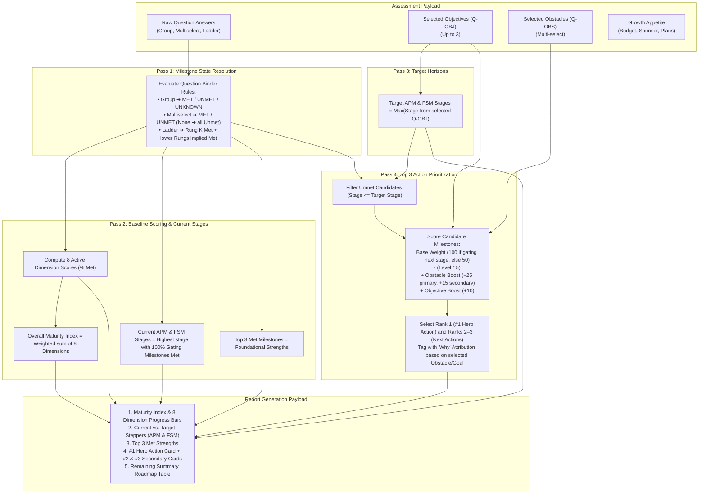

# MAS Growth Readiness Assessment — Handover & Implementation Guide

## Executive Summary

The **MAS Growth Readiness Assessment (v3)** evaluates an organization's operational practices across core Maximo capability pillars to diagnose maturity, determine expansion readiness for **Asset Performance Management (APM)** and **Field Service Management (FSM)**, and generate a tailored, executive-ready 2-page action report.

### Core Architecture & Operating Principles
1. **Source of Truth in Excel:** All question schemas, milestone bindings, journey stage narratives, and scoring rules are authored and governed in two canonical master workbooks: [`Question_Binder.xlsx`](v3-assessment/sources/Question_Binder.xlsx:1) (question contracts and scoring formulas) and [`Milestone_Register.xlsx`](v3-assessment/sources/Milestone_Register.xlsx:1) (60 milestones across 12 practice pillars).
2. **Deterministic 4-Pass Engine:** The scoring pipeline executes without black-box heuristics or subjective weights:
   - **Pass 1 (Milestone Resolution):** Converts raw user selections (group, multiselect, and ladder questions) into explicit milestone states (`MET`, `UNMET`, `UNKNOWN`).
   - **Pass 2 (Baseline & Stage Gating):** Calculates 0–100% progress across **8 active scored dimensions** (excluding unassessed or operational prerequisite pillars), computes a composite Overall Maturity Index, and identifies the customer's current APM and FSM stages using strict stage-gating rules.
   - **Pass 3 (Target Horizons):** Maps the customer's selected strategic objectives (`Q-OBJ`) to target APM and FSM maturity stages.
   - **Pass 4 (Action Prioritization):** Filters unmet milestones up to target stages, scores them based on foundational gating depth, and applies deterministic boosts (+25/+15 pts) for overcoming stated operational obstacles (`Q-OBS`) to select the **Top 3 Immediate Actions** (#1 Hero Recommendation + #2 & #3 Next Steps).
3. **Dual-Viewport Delivery (Web vs. 2-Page Print):** The resulting data payload drives both an interactive web dashboard and a strict, deterministic 2-page Letter-size PDF leave-behind designed with fixed height budgets to prevent accidental page overflow.

This document serves as the implementation contract and architectural handover for engineering teams implementing the compiler, scoring engine, and report UI in the target production repository.

---

## 1. Authoritative Source Spreadsheets to Bring Over

The single source of truth for the assessment model resides in two Excel workbooks in `v3-assessment/sources/`:

| Workbook File | Primary Purpose & Sheets to Ingest |
| :--- | :--- |
| **`Question_Binder.xlsx`** | **The Question Design & Rules Contract Layer**<br/>• `Question Manifest`: Question ordering, groupings, section routing, required/optional flags.<br/>• `Objectives`: Goal $\rightarrow$ APM & FSM target journey stage mappings.<br/>• `Obstacles`: Friction point $\rightarrow$ Primary & Secondary Milestone resolution.<br/>• `Milestone Qs — Group`: 3-state sub-question definitions (`Consistently in place`, `Partially/not`, `Unknown`).<br/>• `Milestone Qs — Multiselect`: Checkbox definitions with deterministic "None of the above" Unmet rule.<br/>• `Milestone Qs — Ladder`: Ordered single-select ladders with Implied-Met and Floor logic.<br/>• `Growth Appetite`: Propensity scoring for budget, sponsor, plans, and investment horizon.<br/>• **`Scoring`** *(New)*: Exact weights (8 active scored dimensions), maturity index formula, stage gating rules, and Top 3 action prioritization algorithm. |
| **`Milestone_Register.xlsx`** | **The Milestone & Capability Taxonomy Master**<br/>• `Milestone Register`: 60 milestones, 12 practice pillars, Option B leveling, signals, prerequisites, customer imperatives, and Met/Unmet/Unknown response templates.<br/>• `APM Journey`: APM Stages 1–5 narrative descriptions, value statements, potential outcome ranges, and MAS product mappings.<br/>• `FSM Journey`: FSM Stages 1–5 narrative descriptions, value statements, potential outcome ranges, and MAS product mappings.<br/>• `Milestone Actions`: Granular remediation steps for deep-dive action planning. |

---

## 2. Design & Architectural Reference Documents

Bring over these markdown and mockup specifications to guide the frontend UI/UX and report generator:

1. **`design/report options/report-web-v-pdf approach - draft ideas.md`**  
   * The architectural blueprint for the 2-page print leave-behind vs. interactive web report.
2. **`design/report options/preview-2page-split.html`**  
   * Working HTML/CSS implementation demonstrating exact `@media print` letter-portrait pagination and card layout budgets.
3. **`_context/wiki/decisions.md`**  
   * Authoritative decisions log (D23–D46) explaining Option B leveling, CA-LEVEL-NAME ID convention, and gating vs. context flags.

---

## 3. End-to-End Rules Engine Architecture

The scoring engine operates as a deterministic 4-pass pipeline:



---

## 4. Scored Dimensions & Weighting Contract

| Dimension ID | Dimension Name | Scored? | Track Scope | Weight | Included Milestones | Formula |
| :--- | :--- | :---: | :---: | :---: | :--- | :--- |
| `DIM-AD` | **Asset Data** | **YES** | Shared | **15%** | `AD-1-REG`, `AD-1-CRIT`, `AD-2-CLAS`, `AD-2-HIER` | $(\text{Met} / \text{Total}) \times 100$ |
| `DIM-WM` | **Work Management** | **YES** | Shared | **15%** | `WM-1-JPBASIC`, `WM-2-JPNEEDS`, `WM-3-JPAR` | $(\text{Met} / \text{Total}) \times 100$ |
| `DIM-IC` | **Inspections & Condition** | **YES** | Shared | **10%** | `IC-1-PROG`, `IC-2-INSB`, `IC-3-METB` (Meter Logging) | $(\text{Met} / \text{Total}) \times 100$ |
| `DIM-SC` | **Supply Chain & Inventory** | **YES** | Shared | **10%** | `SC-1-REG`, `SC-2-BASICS`, `SC-3-PLAN`, `SC-4-OPT` | $(\text{Met} / \text{Total}) \times 100$ |
| `DIM-RP` | **Reliability Practices** | **YES** | APM | **15%** | `RP-1-FC`, `RP-2-RS`, `RP-3-FMEA`, `RP-5-FGOV` | $(\text{Met} / \text{Total}) \times 100$ |
| `DIM-CM` | **Condition Monitoring** | **YES** | APM | **15%** | `CM-1-LF`, `CM-3-IOT`, `CM-2-TRIG`, `CM-2-HLTH`, `CM-3-MVAR`, `CM-4-PRED`, `CM-5-RCBF`, `CM-6-LCFDBK` | $(\text{Met} / \text{Total}) \times 100$ |
| `DIM-SCH` | **Scheduling** | **YES** | FSM | **10%** | `SCH-1-DATES`, `SCH-2-FWD`, `SCH-3-CONS` | $(\text{Rung} / \text{MaxRung}) \times 100$ |
| `DIM-AS` | **Assignment & Dispatch**| **YES** | FSM | **10%** | `AS-1-OWN`, `AS-2-CENT`, `AS-3-BEST` | $(\text{Rung} / \text{MaxRung}) \times 100$ |
| `DIM-WA` | Workforce Availability | **NO** | FSM | 0% | `WA-1-BAS`, `WA-2-ACT`, `WA-3-EFF` | Operational pre-condition |
| `DIM-WE` | Work Execution | **NO** | Shared | 0% | `WE-1-DESK` through `WE-8-AI` | Unassessed in questionnaire |
| `DIM-HS` | Safety & HSE | **NO** | Shared | 0% | `HS-2-JPS`, `HS-2-INC` | Incomplete milestone set |
| `DIM-AIP`| Investment Planning | **NO** | APM | 0% | `AIP-#-##` | Future capability track |

*Note: `IC-3-METB` is strictly focused on **Meter Reading Capture** (data foundation). Automated threshold work generation is evaluated separately as **`CM-2-TRIG` (Condition-Based Maintenance Triggers)** in the Condition Monitoring pillar.*

---

## 5. TypeScript Rules Engine Reference Implementation

```typescript
// types.ts
export type MilestoneStatus = 'MET' | 'UNMET' | 'UNKNOWN';

export interface AssessmentResponsePayload {
  objectives: string[]; // e.g. ['Q-OBJ_opt1', 'Q-OBJ_opt3']
  obstacles: string[];  // e.g. ['Q-OBS_opt2', 'Q-OBS_opt4']
  groupAnswers: Record<string, 'consistently' | 'partially' | 'unknown'>;
  multiselectAnswers: Record<string, string[]>;
  ladderAnswers: Record<string, number>;
  growthAppetite: {
    budget: number;
    sponsor: number;
    plans: number;
    horizon: number;
  };
}

// engine.ts
export function runAssessmentScoring(
  payload: AssessmentResponsePayload,
  binderData: QuestionBinderExport,
  registerData: MilestoneRegisterExport
) {
  // 1. Resolve Milestone States
  const milestoneStates: Record<string, MilestoneStatus> = {};
  
  // Group Qs
  for (const [qid, ans] of Object.entries(payload.groupAnswers)) {
    const mid = binderData.groupMappings[qid];
    if (mid) {
      milestoneStates[mid] = ans === 'consistently' ? 'MET' : (ans === 'partially' ? 'UNMET' : 'UNKNOWN');
    }
  }

  // Multiselect Qs
  for (const [qid, selectedOptions] of Object.entries(payload.multiselectAnswers)) {
    const qMeta = binderData.multiselectQuestions[qid];
    const isNone = selectedOptions.includes(qMeta.noneOptionId);
    for (const opt of qMeta.options) {
      if (opt.isNone) continue;
      if (isNone) {
        milestoneStates[opt.milestoneId] = 'UNMET';
      } else if (selectedOptions.includes(opt.id)) {
        milestoneStates[opt.milestoneId] = 'MET';
      } else if (selectedOptions.length > 0) {
        milestoneStates[opt.milestoneId] = 'UNMET';
      } else {
        milestoneStates[opt.milestoneId] = 'UNKNOWN';
      }
    }
  }

  // Ladder Qs (Implied Met)
  for (const [qid, chosenOrder] of Object.entries(payload.ladderAnswers)) {
    const qMeta = binderData.ladderQuestions[qid];
    for (const rung of qMeta.rungs) {
      if (!rung.milestoneId) continue;
      if (chosenOrder === 0) {
        milestoneStates[rung.milestoneId] = 'UNMET';
      } else if (rung.order <= chosenOrder) {
        milestoneStates[rung.milestoneId] = 'MET';
      } else {
        milestoneStates[rung.milestoneId] = 'UNMET';
      }
    }
  }

  // 2. Compute Dimension Scores & Overall Maturity
  const dimensionScores: Record<string, number> = {};
  let overallMaturityIndex = 0;

  for (const dim of binderData.scoringDimensions.filter(d => d.scored)) {
    let score = 0;
    if (dim.type === 'ladder') {
      const highestMet = dim.milestoneIds.filter(id => milestoneStates[id] === 'MET').length;
      score = (highestMet / dim.milestoneIds.length) * 100;
    } else {
      const metCount = dim.milestoneIds.filter(id => milestoneStates[id] === 'MET').length;
      score = (metCount / dim.milestoneIds.length) * 100;
    }
    dimensionScores[dim.id] = score;
    overallMaturityIndex += score * (dim.weightPercent / 100);
  }

  // 3. Current Stage Gating
  const currentApmStage = evaluateStageGating(milestoneStates, registerData.apmGatingStages);
  const currentFsmStage = evaluateStageGating(milestoneStates, registerData.fsmGatingStages);

  // 4. Target Stages
  const targetApmStage = Math.max(1, ...payload.objectives.map(o => binderData.objectives[o]?.apmTarget || 1));
  const targetFsmStage = Math.max(1, ...payload.objectives.map(o => binderData.objectives[o]?.fsmTarget || 1));

  // 5. Prioritize Top 3 Actions
  const unmetCandidates = registerData.allMilestones.filter(m => 
    milestoneStates[m.id] === 'UNMET' &&
    ((m.apmStage && m.apmStage <= targetApmStage) || (m.fsmStage && m.fsmStage <= targetFsmStage))
  );

  const scoredActions = unmetCandidates.map(m => {
    let score = m.isGatingNextStage ? 100 : 50;
    score -= (m.level * 5); // earlier rungs rank first

    let reasonTag = `Foundational prerequisite for ${m.primaryTrack} Stage ${m.stage}`;
    
    // Check Obstacle match
    const matchedObstacle = payload.obstacles.find(obsId => {
      const obs = binderData.obstacles[obsId];
      return obs?.primaryMilestone === m.id || obs?.secondaryMilestone === m.id;
    });

    if (matchedObstacle) {
      const isPrimary = binderData.obstacles[matchedObstacle].primaryMilestone === m.id;
      score += isPrimary ? 25 : 15;
      reasonTag = `Overcomes Stated Obstacle: "${binderData.obstacles[matchedObstacle].optionText}"`;
    }

    return { ...m, priorityScore: score, reasonTag };
  });

  scoredActions.sort((a, b) => b.priorityScore - a.priorityScore);

  return {
    milestoneStates,
    dimensionScores,
    overallMaturityIndex: Math.round(overallMaturityIndex),
    currentApmStage,
    currentFsmStage,
    targetApmStage,
    targetFsmStage,
    primaryAction: scoredActions[0] || null,
    secondaryActions: scoredActions.slice(1, 3),
    remainingRoadmap: scoredActions.slice(3)
  };
}

function evaluateStageGating(states: Record<string, MilestoneStatus>, gatingStages: Record<number, string[]>): number {
  let attainedStage = 1;
  for (let s = 1; s <= 5; s++) {
    const required = gatingStages[s] || [];
    const allMet = required.every(id => states[id] === 'MET');
    if (allMet && required.length > 0) {
      attainedStage = s;
    } else {
      break;
    }
  }
  return attainedStage;
}
```
