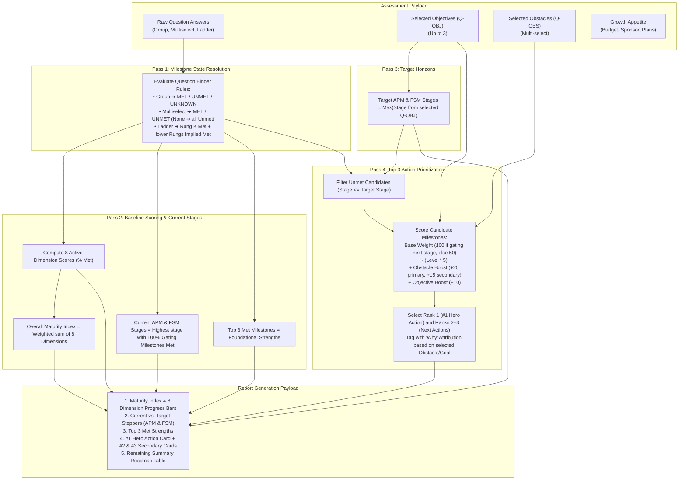

# MAS Growth Readiness Assessment — Handover & Implementation Guide

## Executive Summary

The **MAS Growth Readiness Assessment (v3)** evaluates an organization's operational practices across core Maximo capability pillars to diagnose maturity, determine expansion readiness for **Asset Performance Management (APM)** and **Field Service Management (FSM)**, and generate a tailored, executive-ready action report.

### Core Architecture & Operating Principles
1. **Source of Truth in Excel:** All question schemas, milestone bindings, journey stage narratives, and scoring rules are authored and governed in two canonical master workbooks: [`Question_Binder_Sep20.xlsx`](Logic/Question_Binder_Sep20.xlsx) (question contracts and scoring formulas) and [`Milestone_Register_Sep20.xlsx`](Logic/Milestone_Register_Sep20.xlsx) (61 milestones across 12 practice pillars).
2. **Deterministic 4-Pass Engine:** The scoring pipeline executes without black-box heuristics or subjective weights:
   - **Pass 1 (Milestone Resolution):** Converts raw user selections (group, multiselect, and ladder questions) into explicit milestone states (`MET`, `UNMET`, `UNKNOWN`).
   - **Pass 2 (Baseline & Stage Gating):** Calculates 0–100% progress across **8 active scored dimensions** (excluding unassessed or operational prerequisite pillars), computes a composite Overall Maturity Index, and identifies the customer's current APM and FSM stages using strict stage-gating rules.
   - **Pass 3 (Target Horizons):** Maps the customer's selected strategic objectives (`Q-OBJ`) to target APM and FSM maturity stages.
   - **Pass 4 (Action Prioritization):** Filters unmet milestones up to target stages, scores them based on foundational gating depth, and applies deterministic boosts (+25/+15 pts) for overcoming stated operational obstacles (`Q-OBS`) to select the **Top 3 Immediate Actions** (#1 Hero Recommendation + #2 & #3 Next Steps).

This document serves as the implementation contract and architectural handover for engineering teams implementing the scoring engine and report UI.

---

## 1. Authoritative Source Spreadsheets

The single source of truth for the assessment model resides in two Excel workbooks in `Logic/`:

| Workbook File | Primary Purpose & Sheets to Ingest |
| :--- | :--- |
| **`Question_Binder_Sep20.xlsx`** | **The Question Design & Rules Contract Layer** • `Question Manifest`: Question ordering, groupings, section routing, required/optional flags. • `Objectives`: Goal $\rightarrow$ APM & FSM target journey stage mappings. • `Obstacles`: Friction point $\rightarrow$ Primary & Secondary Milestone resolution. • `Milestone Qs — Group`: 3-state sub-question definitions (`Consistently in place`, `Partially/not`, `Unknown`). • `Milestone Qs — Multiselect`: Checkbox definitions with deterministic "None of the above" Unmet rule. • `Milestone Qs — Ladder`: Ordered single-select ladders with Implied-Met and Floor logic. • `Growth Appetite`: Propensity scoring for budget, sponsor, plans, and investment horizon. • **`Scoring`**: Exact weights (8 active scored dimensions), maturity index formula, stage gating rules, and Top 3 action prioritization algorithm. |
| **`Milestone_Register_Sep20.xlsx`** | **The Milestone & Capability Taxonomy Master** • `Milestone Register`: 60 milestones, 12 practice pillars, Option B leveling, signals, prerequisites, customer imperatives, and Met/Unmet/Unknown response templates. • `APM Journey`: APM Stages 1–5 narrative descriptions, value statements, potential outcome ranges, and MAS product mappings. • `FSM Journey`: FSM Stages 1–5 narrative descriptions, value statements, potential outcome ranges, and MAS product mappings. • `Milestone Actions`: Granular remediation steps for deep-dive action planning. |

---

## 2. End-to-End Rules Engine Architecture

The scoring engine operates as a deterministic 4-pass pipeline:

---

## 3. Scored Dimensions & Weighting Contract

| Dimension ID | Dimension Name | Scored? | Track Scope | Weight | Included Milestones | Formula |
| :--- | :--- | :---: | :---: | :---: | :--- | :--- |
| `DIM-AD` | **Asset Data** | **YES** | Shared | **15%** | `AD-1-REG`, `AD-1-CRIT`, `AD-2-CLAS`, `AD-2-HIER` | $(\text{Met} / \text{Total}) \times 100$ |
| `DIM-WM` | **Work Management** | **YES** | Shared | **15%** | `WM-1-JPBASIC`, `WM-2-JPNEEDS`, `WM-3-JPAR` | $(\text{Met} / \text{Total}) \times 100$ |
| `DIM-IC` | **Inspections & Condition** | **YES** | Shared | **10%** | `IC-1-PROG`, `IC-2-INSB`, `IC-3-METB` (Meter Logging) | $(\text{Met} / \text{Total}) \times 100$ |
| `DIM-SC` | **Supply Chain & Inventory** | **YES** | Shared | **10%** | `SC-1-REG`, `SC-2-BASICS`, `SC-3-PLAN`, `SC-4-OPT` | $(\text{Met} / \text{Total}) \times 100$ |
| `DIM-RP` | **Reliability Practices** | **YES** | APM | **15%** | `RP-1-FC`, `RP-2-RS`, `RP-3-FMEA`, `RP-5-FGOV` | $(\text{Met} / \text{Total}) \times 100$ |
| `DIM-CM` | **Condition Monitoring** | **YES** | APM | **15%** | `CM-1-LF`, `CM-3-IOT`, `CM-2-TRIG`, `CM-2-HLTH`, `CM-3-MVAR`, `CM-4-PRED`, `CM-5-RCBF`, `CM-6-LCFDBK` | $(\text{Met} / \text{Total}) \times 100$ |
| `DIM-SCH` | **Scheduling** | **YES** | FSM | **10%** | `SCH-1-DATES`, `SCH-2-FWD`, `SCH-3-CONS` | $(\text{Rung} / \text{MaxRung}) \times 100$ |
| `DIM-AS` | **Assignment & Dispatch**| **YES** | FSM | **10%** | `AS-1-OWN`, `AS-2-CENT`, `AS-3-BEST` | $(\text{Rung} / \text{MaxRung}) \times 100$ |
| `DIM-WA` | Workforce Availability | **NO** | FSM | 0% | `WA-1-BAS`, `WA-2-ACT`, `WA-3-EFF` | Operational pre-condition |
| `DIM-WE` | Work Execution | **NO** | Shared | 0% | `WE-1-DESK` through `WE-8-AI` | Unassessed in questionnaire |
| `DIM-HS` | Safety & HSE | **NO** | Shared | 0% | `HS-2-JPS`, `HS-2-INC` | Incomplete milestone set |
| `DIM-AIP`| Investment Planning | **NO** | APM | 0% | `AIP-#-##` | Future capability track |

*Note: `IC-3-METB` is strictly focused on **Meter Reading Capture** (data foundation). Automated threshold work generation is evaluated separately as **`CM-2-TRIG` (Condition-Based Maintenance Triggers)** in the Condition Monitoring pillar.*

---

## 4. What Isn't Implemented Yet

The following are specified in the workbooks but not yet present in the codebase:

- **Scoring engine** — milestone state resolution and all four passes described above. Answer payloads are captured by `js/app.js` and fired as an `assessment:submit` event, but nothing consumes them yet.
- **Report output** — no results page, score display, or action recommendations exist. The `assessment:submit` event is the intended hook.
- **Follow-up gating** — the four Growth Appetite questions (`followUp: true` in `data/assessment.js`) should appear only after the report, when the user opts in. Currently they render inline with the rest of the assessment.
- **Skip conditions** — `skipCondition` fields are carried through on question objects in `data/assessment.js` but have no evaluator in `app.js`.
