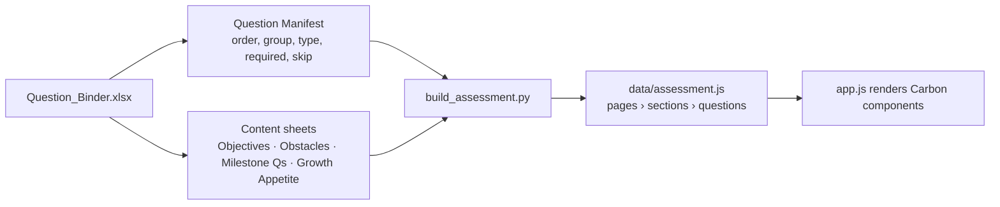

# M-GRAT — MAS Growth Readiness Assessment

A static web assessment and personalised report built with IBM Carbon Web Components. Questions come from the Question Binder spreadsheet. No build tooling, no `node_modules`.

---

## What's in the folder

| Path | What it is | Edit? |
|------|-----------|-------|
| `index.html` | Assessment page shell: sidebar banner, progress bar, empty `#sections`, Back/Next bar | Rarely |
| `report.html` | Report page shell: sticky sidebar nav, section anchors, Carbon WC imports | Rarely |
| `css/styles.css` | Shared styling — Carbon white-theme tokens, layout, tiles, matrix, breakpoints | Yes |
| `css/report.css` | Report-specific styles — sidebar, expansion cards, stage rail, action plan, bonus block | Yes |
| `js/app.js` | Assessment renderer and behaviour: builds pages from data, captures answers, scores, navigates | Yes |
| `js/report.js` | Report renderer: reads `sessionStorage["scoringResult"]`, renders all report sections | Yes |
| `js/scoring.js` | Scoring engine: 4-pass algorithm (milestone states → maturity score → target stages → action plan) | Yes |
| `data/assessment.js` | Generated questions — **do not hand-edit** | No |
| `data/journey.js` | APM and FSM journey stage definitions (names, value statements, outcomes, products) | Yes |
| `data/milestone-actions.js` | Remediation step definitions keyed by milestone ID | Yes |
| `scripts/build_assessment.py` | Compiler: reads the Question Binder workbook, writes `data/assessment.js` | Only if the binder gains a new column or type |
| `scripts/serve.py` | Dev server on `127.0.0.1:8765` with caching off; watches the binder and recompiles on save | Rarely |
| `Logic/Question_Binder_Sep20.xlsx` | **Source of truth** for all questions, options, milestone mapping, scoring metadata | Yes — this is how content changes |
| `Logic/Milestone_Register_Sep20.xlsx` | Milestone definitions and stage gating rules | For scoring changes |
| `Logic/milestone_graph.json` | Compiled milestone graph consumed by the scoring engine | Generated — do not hand-edit |
| `assets/` | Icons, pictograms, app icon, IBM Plex Math font | Only to swap art |

---

## Run locally

```bash
cd ~/Documents/GitHub/M-GRAT && python3 scripts/serve.py
```

Then open **http://127.0.0.1:8765/** in a browser.

- On start it compiles the binder once, then prints `Watching Logic/Question_Binder*.xlsx`.
- Save the workbook → it rebuilds `data/assessment.js` within ~2 s. Refresh the browser to see it.
- A compile error prints `build failed` and the offending Question ID or sheet; the page keeps serving the last good build.
- Stop with **Ctrl+C**. Use a different port: `python3 scripts/serve.py 3000`.

> **Don't** use `python3 -m http.server` — it lets the browser cache `app.js` and edits look like they didn't apply.  
> **Don't** open `index.html` from Finder — `file://` blocks ES module imports.

The page requires a network connection for Carbon (`1.www.s81c.com`) and IBM Plex (Google Fonts). Nothing is installed locally.

---

## How the spreadsheet becomes the page



The compiler collapses the binder's six question types into three page layouts:

| Binder type | Page layout | Key fields |
|-------------|------------|------------|
| `milestone-group` | Matrix (rows × Met/Unmet/Unknown columns) | `milestoneId` per row |
| `objectives` | Multi-select tiles | `maxSelections`, `apmStage`, `fsmStage` per option |
| `obstacles` | Multi-select tiles | `milestoneId`, `secondaryMilestoneId` per option |
| `milestone-multiselect` | Multi-select tiles | `isNoneOption` (exclusive); `unansweredBehavior` |
| `milestone-ladder` | Single-select tiles, ordered | `order`, `isFloor`, `milestoneId`; question flagged `ladder` |
| `growth-appetite` | Single-select tiles | `score`, `signalLabel` per option |

Page composition is the `PAGES` list at the top of `build_assessment.py`. A Group ID not in that list still renders on an auto-page named after its Manifest Section, with a warning printed at build time.

---

## Making content changes

Edit **`Logic/Question_Binder_Sep20.xlsx`** while `serve.py` is running — it recompiles automatically. Saving the workbook is the only change workflow for content.

### Edit a question (wording, options, metadata)
1. Open `Logic/Question_Binder_Sep20.xlsx`
2. Go to the relevant content sheet (`Objectives`, `Obstacles`, `Milestone Qs`, or `Growth Appetite`)
3. Find the row by its **Question ID** and edit the cell(s)
4. **Save the workbook** (`Cmd+S`)
5. The terminal prints `Built data/assessment.js … X pages, Y questions` within ~2 s
6. **Refresh the browser** — the change is live

### Remove a question
1. Open the **Question Manifest** sheet and delete the row for that Question ID
2. Also delete its row(s) from the content sheet (keeps the workbook clean)
3. Save → compiler drops it; refresh the browser

> ⚠️ Don't delete only from the content sheet and leave it in the Manifest — the compiler will warn and render an empty question.

### Add a new question
1. On the **Question Manifest** sheet, add a new row with a unique Question ID (e.g. `Q-OB-007`), the correct Group ID, Section, Type, Required flag, and page order
2. On the matching content sheet for that type, add the row(s) using the same Question ID
3. Save → compiler picks it up; refresh the browser

> ⚠️ The Question ID must match **exactly** between the Manifest and the content sheet. A mismatch silently drops the question and prints a warning in the terminal.

### Reorder questions or pages
- **Question order within a page** → change the order column in the **Question Manifest**
- **Which page a question appears on** → edit the `PAGES` list in `scripts/build_assessment.py` (the one thing that requires a code change)

### Check for compile errors
Watch the terminal. On a bad save:
```
build failed — <Question ID or sheet name>
```
The page keeps serving the last good build until you fix it and save again.

### When a code change is needed
Only when:
- A new **question type** is added (add a builder to `BUILDERS` in `build_assessment.py`)
- A new **column** should affect rendering (map it in the relevant builder)
- A **sheet or header is renamed** (looked up by name throughout the compiler)

---

## Key gotchas

- **Carbon buttons don't submit forms.** The real `<button>` is in the shadow root and isn't form-associated. `Next` is wired to the host's `click` (and `submit` on the form for Enter). Don't rely on `type="submit"` on `cds-button`.
- **Don't set `checked` on `cds-radio-button` from outside.** Forward clicks to `control.shadowRoot.querySelector('input').click()` — that's what the tile handler already does.
- **`cds-radio-button-changed` fires for every radio in the group**, including the ones being unchecked. Handlers re-read state for the whole group.
- **Toggletip `autoalign` scrolls the page.** Use a fixed `alignment` instead (`alignment="left"`).
- **Sticky banner + scroll anchoring = oscillation.** The banner is `position: fixed` with the main column padded by its expanded height, and `overflow-anchor: none` on `html`. Don't switch it back to `sticky`.
- **Browser cache hides edits.** `serve.py` sends `no-store`. If behaviour doesn't match the code, hard-refresh once.
- **Figma PNG re-exports bake in the dark canvas.** The PNG in `assets/` came from the design source with transparency intact — don't re-export from Figma without checking.
- **Question IDs must match exactly** between the Manifest and the content sheet. A mismatch drops the question silently with a warning.

---

## Report page

Open `http://127.0.0.1:8765/report.html` after completing the assessment. The report reads `sessionStorage["scoringResult"]` written by `js/app.js` when the user submits. In the absence of a real result it falls back to a representative mock so the page can be previewed standalone.

### Report sections

| Section | ID | What it shows |
|---|---|---|
| Where you are today | `#act-today` | Maturity index score, dimension breakdown, established milestones |
| Opportunities to increase ROI | `#act-roi` | APM and FSM expansion path cards with interactive stage rail |
| How to reach your target | `#act-plan` | Top 3 prioritised next steps + details + additional resources |
| Help us improve | `#act-improve` | Follow-up feedback form |

### Stage rail labels

Each stage card in the APM/FSM expansion rail receives one of five labels derived from the scoring result:

| Condition | Label |
|---|---|
| `index < currentIndex` | Completed stage |
| `index === currentIndex` | Your current stage |
| `currentIndex < index < targetIndex` | Transitional stage |
| `index === targetIndex` | Your target stage |
| `index > targetIndex` | Expansion stage |

### Scoring engine passes

| Pass | Input | Output |
|---|---|---|
| Pass 1 | Answers + question binder | Milestone states (MET / UNMET / UNKNOWN) |
| Pass 2 | Milestone states | Maturity score, current APM/FSM stage |
| Pass 3 | Selected objectives (Q-OBJ) | Target APM/FSM stage |
| Pass 4 | All of the above | Top 3 prioritised action steps + roadmap table |

### Stage gating rule (Pass 2)

Current stage = highest stage `s` where **no gating milestone is explicitly `UNMET`**.

`UNKNOWN` milestones — those belonging to unassessed dimensions (`DIM-WE`, `DIM-HS`, `DIM-AIP`) that have no corresponding question in the questionnaire — do **not** block stage progression. Only a definitive `UNMET` answer from a question the user actually answered will prevent a stage from being reached.

```
// js/scoring.js — currentStage()
noneUnmet = gatingMilestones.every(n => milestoneStates[n.id] !== "UNMET")
```

This aligns with the handover guide which marks `DIM-WE` (Work Execution) as *"Unassessed in questionnaire"* and `DIM-HS` (Safety) as *"Incomplete milestone set"*.

---

## What isn't done yet

In rough priority order.

- [ ] **Submit destination** — `assessment:submit` fires with the answers object but sends them nowhere
- [ ] **Follow-up gating** — the four Growth Appetite questions (`followUp: true`) should appear only after the report, when the user opts in
- [ ] Skip conditions aren't evaluated (`skipCondition` field exists on questions but has no evaluator)
- [ ] Page composition lives in code (`PAGES` list in `build_assessment.py`)
- [ ] Page titles for pages 2–5 are placeholders
- [ ] No persistence — refreshing loses answers (`sessionStorage` on `state.answers` is ~10 lines)
- [ ] No automated tests (behaviour verified by hand in Chrome at 1728 / 1440 / 1280 / 1024 / 375 px)
- [ ] Real-device check on iOS (fixed banner + safe-area inset + overscroll untested on hardware)

---

## Design references

The page is built to the **Consumability** file in Figma. Ask Ashish for edit access.

| What | Figma node |
|------|-----------|
| Full screen (questions + banner) | Consumability `593:3771` |
| Banner | Consumability `597:4246` |
| Artwork | Consumability `599:5509` |
| MAS Growth Assessment layouts | `985:18661` (view-only) |

